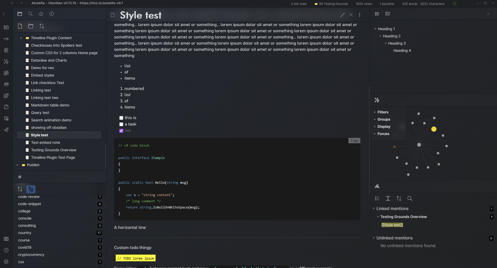

# Sodalite for Obsidian

## About

This is the relatively opinionated Sodalite theme for [Obsidian](https://obsidian.md/). Inspired by in part some Windows 10 and 11 design ideas (Fluent, Mica). The theme only supports dark mode, as of v0.1.

Tested with Obsidian v1.3.4.

I've made several other useful snippets and tidbits, these are available at my obsidian-toolkit repo: https://github.com/tomzorz/obsidian-toolkit

## Relatively Opinionated?

### Unusual title formatting

As Obsidian prominently features the note title in a separate title-bar outside of the document itself, this theme scales that title up to H1 size.

### Unusual status bar placement

To save on the typically limited vertical screen space, the theme moves the status bar into the right side of the title bar.

## Installation

In Obsidian, navigate to **Settings > Appearance > Themes** - you should be able to find it in the list there.

Alternatively, download the `sodalite.css` file to you vault's `.obsidian/themes` folder and select it under **Settings > Appearance**.

## Recommended Settings

Sodalite is optimized for the following appearance settings:

- appearance > advanced > show inline title **OFF**
- appearance > advanced > native menus **OFF**
- appearance > advanced > show tab title bar **ON**
- appearance > advanced > window frame style **Hidden**

## Snippets

Sodalite offers CSS snippets to alter certain smaller aspects of the theme.

| File name                  | Description                                                      |
| -------------------------- | ---------------------------------------------------------------- |
| content-max-width-1100.css | Limits maximum width of content to 1100 px and center aligns it. | 
| content-max-width-900.css  | Limits maximum width of content to 900 px and center aligns it.  |
| content-max-width-700.css  | Limits maximum width of content to 700 px and center aligns it.  |

These can be found in the `snippets` folder of the repository.

## Changelog

**0.8.1**

- fixed titlebar drag issue #8

**0.8.0**

- remove workaround from earlier to re-fix search area #12
- added theming for callouts #9
- file tree highlighted item no longer flips between regular/bold font-weight on hover #14
- improved styling of "special" files in the file tree, e.g. canvas, images #15
- made tooltips more legible #18
- fixed weird padding on right sidebar collapse button when collapsed #17
- graph view settings are small now when closed #16
- added recommended appearance settings to readme #19
- fixed scroll-below on new bookmarks plugin #20

**0.7.1**

- fixed missing scrollbars in settings #5
- fixed broken search field button #6

**0.7.0**

- Updated theme for Obsidian v1.0 and above

**0.6.5**

- Fixed foldable headings gutter background

**0.6.4**

- Fixed scroll under styling for the new editor / live preview

**v0.6.3**

- 2nd attempt at Mac title bar fixes

**v0.6.2**

- Attempted to fix the title bar on Mac
- Added a fade in animation to the sync-working indicator animation, so it only shows up if the sync is taking longer than 0.5s
- Fixed a dark background column in edit mode when collapsing headers was turned on

**v0.6.1**

- Moved modal close button to the right

**v0.6.0**

- Updated screenshot
- Added sync working title bar animation
- Adjusted sync icon size
- Fixed a bug with multiple vertically split middle views

**v0.5.2**

- Added a bit of extra padding on the bottom of the frontmatter

**v0.5.1**

- Adjusted suggestion container styling to match other popups
- Fixed selected text styling to be more visible
- Matched edit mode tag colors to preview mode tag colors

**v0.5.0**

- Added styling for button hover state
- Added stying for tooltips
- Added styling for notices
- Consolidated the active style for vertical-tabs with the file listing
- Fixed some mobile issues (middle area button paddings, graph controls positioning)

**v0.4.0**

- Added styling for the prompt
- Added styling for buttons
- Fixed graph line colors

**v0.3.0**

- Added styling for modals
- Fixed various issues on mobiles

**v0.2.0**

- Added support for the Sliding Panes plugin

**v0.1.3**

- Fixed the graph controls first option being hidden if the graph was open in the middle

**v0.1.2**

- Styled right-click menu.
- Fixed status-bar covering up the back-fwd buttons
- Status bar automatically disappears when window is less than 1200px wide

**v0.1.1**

- Fixed css filename for the community listing.

**v0.1**

- Initial release.
